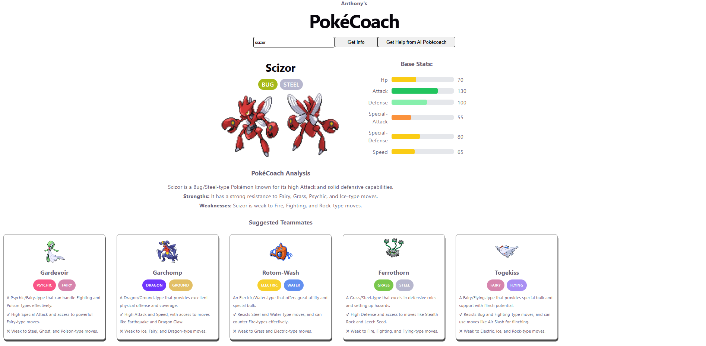
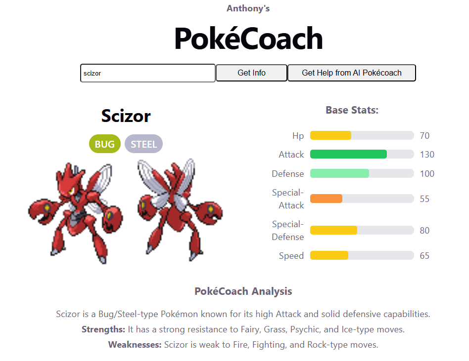
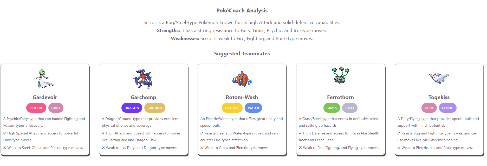
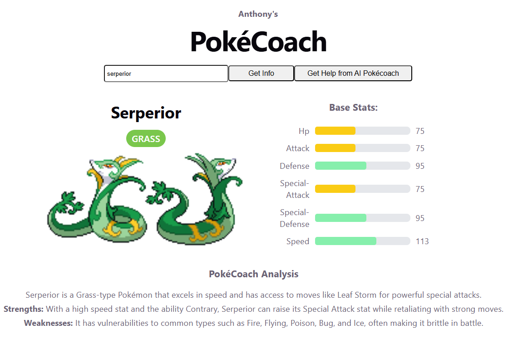
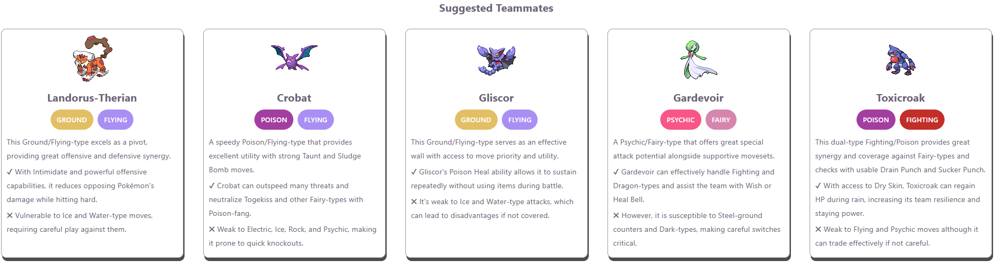
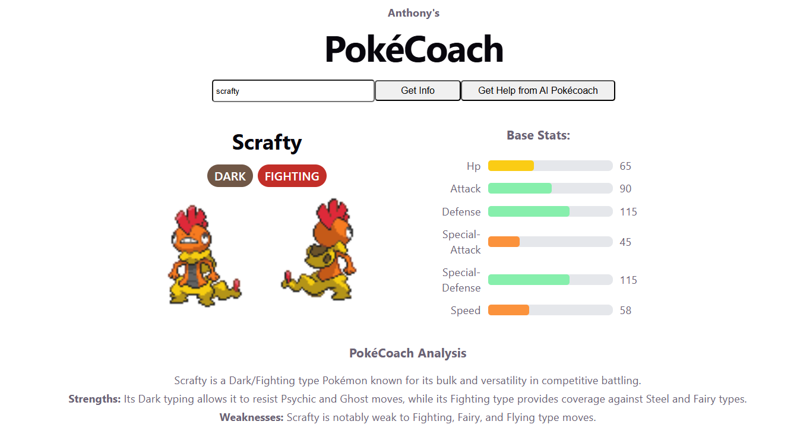
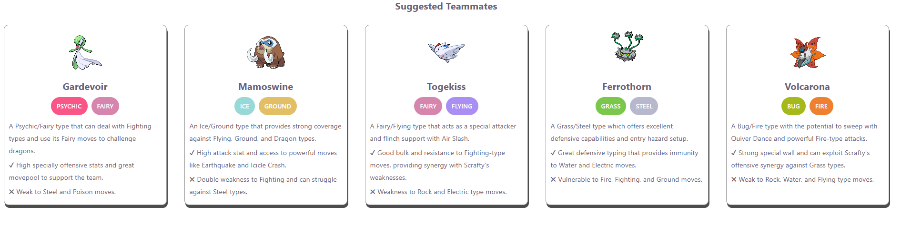
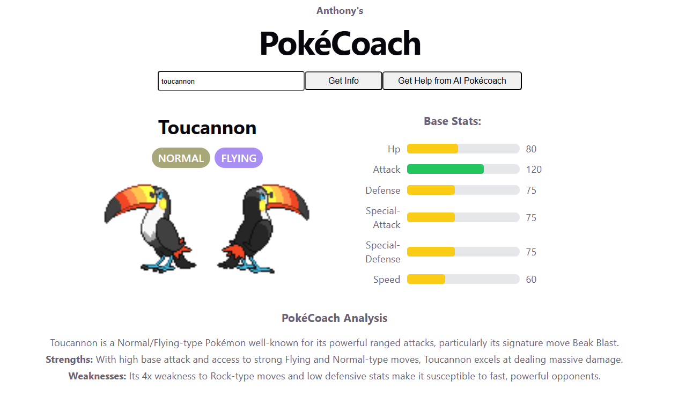
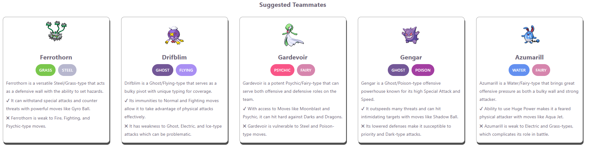

# PokéCoach

  Developed by <strong>Anthony Liscio</strong> 
  <a href="https://github.com/anthony9105">@anthony9105 on GitHub</a>

  
  
  
  
  
  
  

PokéCoach is a React + TypeScript web app that lets users search for Pokémon and get AI-powered analysis, including strengths, weaknesses, and recommended team members.  (Currently just a project I ca run locally, it is not deployed and is just a frontend).

It combines the **PokéAPI** for real Pokémon data and the **OpenAI API** for intelligent battle insights.

## Images

  

  

  

  

---

## Features

- Search any Pokémon by name
- View stats, types, and images from PokéAPI
- AI-generated analysis (descriptions, strengths & weaknesses)
- AI-generated competetive team suggestions (5 Pokémon)
- Suggested teammates displayed with real data
- Visual stat bars and type color badges

---

## Tech Stack

- React (Vite)
- TypeScript
- OpenAI API (`gpt-4o-mini`)
  - Temperature value and prompt are adjusted often to try and find more variety in answers while still being accurate 
- PokéAPI
- CSS
